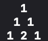
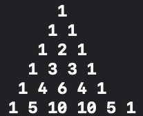
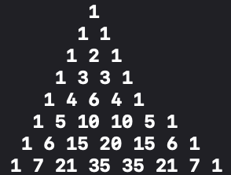
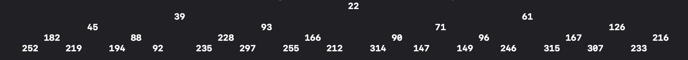

# [DataStructures](https://github.com/GeekingwithMauri/DataStructures)

Elementary data structures and algorithms implemented in Swift language

## Available 

### Search

#### Arrays

- [Binary search (on integer arrays)](https://github.com/GeekingwithMauri/DataStructures/blob/main/Sources/DataStructures/Algorithm/ArraySearch.swift)

#### Graphs

- [BFS and DFS](https://github.com/GeekingwithMauri/DataStructures/blob/main/Sources/DataStructures/Algorithm/GraphNodeSearch.swift)

### Linear data structures
- [Queue](https://github.com/GeekingwithMauri/DataStructures/blob/main/Sources/DataStructures/DataStructures/Linear/Queue.swift)
- [Stack](https://github.com/GeekingwithMauri/DataStructures/blob/main/Sources/DataStructures/DataStructures/Linear/Stack.swift)
- [Linked list](https://github.com/GeekingwithMauri/DataStructures/blob/main/Sources/DataStructures/DataStructures/Linear/LinkedList.swift)

### Non-linear data structures

- [Binary tree](https://github.com/GeekingwithMauri/DataStructures/blob/main/Sources/DataStructures/DataStructures/Non-linear/BinaryTree.swift)
- [Min heap](https://github.com/GeekingwithMauri/DataStructures/blob/main/Sources/DataStructures/DataStructures/Non-linear/MinHeap.swift) node-based implementation (implementation from [Back to Back folks](https://www.youtube.com/watch?v=g9YK6sftDi0))

### Helpful algorithms

#### Mathematics

- [Pascal's triangle](https://en.wikipedia.org/wiki/Pascal%27s_triangle): produces any binomial expansion for a given coefficient. It even prints the Pascal's triangle on console formed to reach said result.

| 2nd power | 5th power | 7th power |
| --- | --- | --- |
|    |    |   |

#### Tree

- `graphicalRepresentation()`: prints in terminal the hierarchical form of previously loaded tree in memory 

